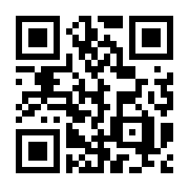
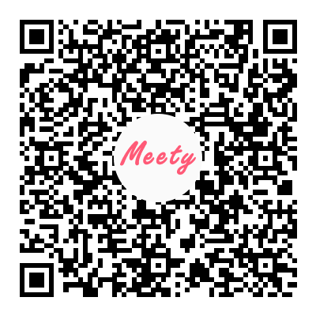
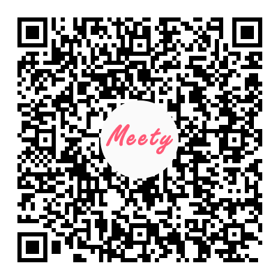

# だれかの進捗をうまく「把握」できないときのフレーズ集
〜 よい計画づくりのために 〜

2023.09.30 コボリアキラ

<!--
- 14:01
- タイトル読み上げ
- 30分以上の登壇ははじめて
- 盛り上がっている感を出そう！　ぜひたくさんコメントしてください。進捗把握出来てるよ〜できてないよーとか
-->

---

# Who is?

  

  ## 💻 編集よりもITを

  2015年にエンジニアにキャリアチェンジ

  

  

  ## 👶 ワークよりもライフを

  2020年に第一子が産まれ、1年間の育休を取得

  

  

  ## 📝 インプットよりもアウトプットを

  がんばって記事を書き続けています

  

  

  ## 🤼‍♀️ 野球よりもプロレスを

  「東京女子プロレス」という沼にハマり中。 坂崎ユカ選手のアクスタが発表を応援してくれてる......！

  

 
 

<!--
- 14:02
- アジャイル4原則をまねてみました
- 育休の話とかはMeetyでぜひ
-->

---
transition: fade-out
layout: default
---

# こんな記事を書いています

今日の発表元になったブログ記事

[だれかの進捗をうまく把握できないときのフレーズ集](https://qiita.com/kobori_akira/items/9ab3e81bbf0d1c00e49f)  

そのほか、次のような記事を書いています

- [「ふつうのエンジニア」になるための、ちょっとした発想の転換](https://qiita.com/kobori_akira/items/02d9808af29a70068d87)
- [非エンジニア向けにもわかるよう「依存」を解説する](https://qiita.com/kobori_akira/items/29a0f6b3350ccb362424)
- [「できる」と「わかる」を区別する](https://qiita.com/kobori_akira/items/7e78d43e40f6b796929d)
- [有野課長のように、あるいはあの頃のボクのように](https://qiita.com/kobori_akira/items/c8129a3a1de9f2b896d4)

<!--
- 14:03
- 今日の発表の元ネタになったブログ。Qiitaは95000viewと1200いいね、はてブは1500のブックマーク
  - 変な炎上もせず、いろいろな意見や感想がもらえてよかった
- 技術が好きだが、ブログにはエンジニアリング以外のことを書いています。よかったら読んでみてください
-->

---
layout: default
transition: fade-out
---

# 目次

0. イントロダクション
1. 「計画づくり」と「進捗」
2. 進捗を把握する難しさ
3. 進捗をうまく把握するために
3. 「進捗」を把握しやすくするフレーズ
4. みんなのフレーズ

<!--
- 14:06
- 今日の目次は次の通り
- 1: 「計画づくり」と「進捗」という言葉について、共通した認識を持ち、その重要性を理解すること。
- 2: つぎに重要な「進捗」を把握することの難しさ
- 3: そして重要な要素である「進捗」をどのように把握すればよいか
- 4: 最後は「進捗」を把握しやすくするための具体的なフレーズをひとつずつ見ていく
- 5: さらには、興味・関心を持って集まっていただいた皆さんがどんなフレーズを使っているか。あるいは使ってみようと浮かんだか教えていただき、この場で拾えたらと思っています
  - この時間ですぐ出ないようであれば、こうしたことを強く意識したキッカケを語ろうと思います
-->

---
transition: fade-out
layout: cover
background: ./images/erik-witsoe-pvoQJym18Jg-unsplash.jpg
---

# イントロダクション

<!--
- というわけで、早速内容に入ってきましょう。さて......
-->

---
transition: slide-up
layout: image-right
image: ./images/brooke-cagle--uHVRvDr7pg-unsplash.jpg
---

# ある日の開発チームにて

- 朝会やデイリースクラムで、お互いの進捗を確認しあっています
- どんなふうに報告するでしょうか？

<!--
- 14:07
- できるかぎり具体的にイメージさせる。Discordへの書き込みも募集
  - 朝8時に起きて支度して、出社もしくはオンラインでデイリーが始まります
  - おそらくは昨日完了したことや今日やることを話すでしょう
  - 実際今週のデイリーはどうでしたか？
  - デイリーやっていない人は、誰かに状況を確認されたときにどう答えるかを考えてみてもよいです
- だいたいは「いま〜の開発を進めてます。今日はその続きをやります」ぐらいでは？
-->

---
transition: fade-out
layout: image-left
image: ./images/brooke-cagle--uHVRvDr7pg-unsplash.jpg
---

# ある日の開発チームにて

- 朝会やデイリースクラムで、お互いの進捗を確認しあっています
- どんなふうに報告してほしいでしょうか？

<!--
- 14:10
- あなたがプロダクト・プロジェクトのマネージャー、あるいはその作業者・チームの進行具合があなたの作業に影響を与える場合を想定してみましょう
- あなたがさきほどした情報共有は、どれくらい嬉しいものですか？
- たとえば「決済機能を開発をひきつづき続けてます」とか「不具合の改修がだいたい終わりました」とか
- あなたがそれを受け取ったあとのリアクションも考えてみたいですね
-->

---
transition: fade-out
layout: cover
background: ./images/erik-witsoe-pvoQJym18Jg-unsplash.jpg
---

# 「計画づくり」と「進捗」

<!--
- 14:10
- 想像してもらったところで、「計画づくり」と「進捗」について語ってみようと思います。
- まず「計画づくり」から考えてみましょう
-->

---
class: px-20
---

# 「アジャイル」と「計画づくり」

見積りと計画づくりは、期日やスケジュールを決定するためだけのものではない。計画づくりとは価値の探求なのだ。\[...\]答えをゴールへと少しつづ近づけていくこと(インクリメンタルに)、そしてそれを繰り返すこと(イテレーティブに)。\[...\]  
たとえばあるプロジェクトで、最初のスケジュールでは一連の機能セットのリリース日を8月31日に設定していたとする。しかし7月に入った時点になって、少し機能を増やして、その分だけリリースを遅らせる判断を下すかもしれない。あるいは少し機能を削ってでも早めにリリースすることに決めるかもしれない。  

『アジャイルな見積りと計画づくり〜価値あるソフトウェアを育てる概念と技法』、p28。

自分なりにかみくだくと...

- 「計画づくり」をすることで、品質・コスト・納期・スコープの調整ができる
- 「計画」ではなく「**計画づくり**」が重要である  （refs: [アジャイル開発は計画しない？](https://qiita.com/kobori_akira/items/6f122372ff114d4ae373)）

<!--
14:13
- いったん引用をすべて読む。
- 「計画づくり」をすることで、QCD(質、コスト、納期)の調整ができる
- できあがった「計画」も大事だが、アジャイルにおいてはそれ以上に「計画づくり」が重要。
  - 計画を見直しつづけることで、アジャイルな開発が達成できる
  - Qiita書いてるのでよろしければ
-->

---
preload: false
---

# よい「計画づくり」とは

  

  よい計画づくりとは、以下のような特徴を持ったプロセスのことだ。  
  いずれも「ソフトウェア開発の問い」に対する答えを見つける手助けとなる。  

  ・**リスクを軽減する**  
  ・**不確実性を減らす**  
  ・**意思決定を支援する**  
  ・信頼を確立する  
  ・情報を伝達する

  

  (同、p29, 太字は引用者。)
  

  

<!--
14:15
- 引用を読む
- よい計画づくりを続けていれば、自然と不確実性・リスクのコントロールができるようになる。コントロールには意思決定も含む
- このプレゼンではとくに太字の3つを取り上げて展開したい
-->

---
layout: center
---

# 「進捗」とは

<!--14:15
つぎに「進捗」が「計画づくり」とどう関連しているのかをおさえましょう
-->

---

# 「進捗」とは

進み具合・捗り具合、物事がどの程度うまく（順調に）進んでいるか、という意味で用いられる語。「進捗は芳しくない」という風に単独で用いられることもあるが、「進捗状況」や「進捗率」のように連語表現として用いられることも多い。
([「進捗(しんちょく)」の意味や使い方 わかりやすく解説 Weblio辞書](https://www.weblio.jp/content/%E9%80%B2%E6%8D%97))

自分なりに再定義すると......

ある時点からある時点までの間の差分

- ざっくり「状況が変わった」みたいなこと
- ポジティブ、ネガティブは関係ないとしている
- タスクが完了しただけでは不十分であることが多い

<!--
14:17
- 辞書的な意味は無視して、もっとわかりやすく表現してみた
- 例: 待ち合わせ場所に行くとき(どこまで着いたか？)
- ネガティブであっても状況が変わったのであれば、それは進捗と捉えたほうがいいと思う
  - ただし環境の変化までは含めない。あくまで自身の行動による影響の範囲内で考える
- TODOリストにおける「完了」がそのまま進捗でないことが重要だと考えている
-->

---

# 進捗であるもの、進捗でないもの

  

  
👍

  - ◯◯機能のリリースをした
  - ◯◯機能のテストが完了した
  - レビューで修正すべき点が明らかになった
  - MTGによって来期の計画が決まった

  

  

  
👎

  - 1時間のMTGをした
  - 実装が進んだ
  - いろいろやった

  

「進捗」のない「完了」も存在する

<!--
14:20
- リリースやテスト完了はとくに違和感ないだろう
  - これは「〜が終わったら次は...をする」みたいなイメージができるから、状況が変わった
- 同じくグッドケースは状況が変わっている
- TODOリストであれば「1時間のMTGをした」ことで完了となる。しかし意味のないMTGだったかもしれない。なにも意思決定ができなかったかもしれない
  - 脱線するが、MTGにおいても「MTG前後で差分が出る」ように意識したほうがいい。差分は意思決定にかぎらず、「相手が〜を知っている状況にする」とかもOK
- 「実装が進んだ」も似ている。進んだことは嬉しい。でもそれで結局なんなの？
  - たとえば「〜のストーリーが完成した」とかだと良い。「開発が難しい開発は終わったので、あとは計画した通りに進められる可能性が高くなった」とかだと最高では？
-->

---

# なぜ「進捗」が重要なのか

  

  ## 計画づくりのため

  「進捗」が出ることによって、計画づくりを続けることができる

  

  

  ## モチベーションのため

  「進捗」は自己効力感・モチベーションを高める

  

  refs: [マネジャーの最も大切な仕事――95%の人が見過ごす「小さな進捗」の力](https://www.amazon.co.jp/%E3%83%9E%E3%83%8D%E3%82%B8%E3%83%A3%E3%83%BC%E3%81%AE%E6%9C%80%E3%82%82%E5%A4%A7%E5%88%87%E3%81%AA%E4%BB%95%E4%BA%8B%E2%80%95%E2%80%9595-%E3%81%AE%E4%BA%BA%E3%81%8C%E8%A6%8B%E9%81%8E%E3%81%94%E3%81%99%E3%80%8C%E5%B0%8F%E3%81%95%E3%81%AA%E9%80%B2%E6%8D%97%E3%80%8D%E3%81%AE%E5%8A%9B-%E3%83%86%E3%83%AC%E3%82%B5%E3%83%BB%E3%82%A2%E3%83%9E%E3%83%93%E3%83%BC%E3%83%AB/dp/4862762409)

  
  

<!--
14:22
- 進捗が出ると計画づくりができる。なぜなら状況が変わるから
  - 乗り物の例ふたたび
- 進捗が出ていることを確認させることも重要
  - 本人は上手に把握していないが、ちゃんと分析すれば大小関係なく「進捗」はあるはず
  - 「昨日と比べて、〜が変わったね！」という勇気づけができる
-->

---
transition: fade-out
---

# ここまでのまとめ

**・「計画づくり」を続けるには「進捗」を出すことが重要**

**・「進捗」を把握すれば「計画づくり」が続けられる**  

**・「進捗」とは差分である**  

**・「進捗」のない「完了」も存在する**  

**・進捗を把握するのは難しい**

**・「これまでどこにいて、いまどこにいるのか」 　「辿り着いてわかったことはなにか」を把握しよう**

<!--
- アジャイル開発において計画づくりが重要であり、そのためには進捗を出すことが重要である
- ここでちょっと水飲みたい
-->

---
transition: fade-out
layout: cover
background: ./images/erik-witsoe-pvoQJym18Jg-unsplash.jpg
---

# 進捗を把握する難しさ

<!--
- 14:23
- 一方で「進捗を把握する」ことは一筋縄ではいかないことを見ていきましょう
- これは自分の進捗だって難しい。他人ならなおさら。
-->

---

# (再掲)進捗であるもの、進捗でないもの

  

  
👍

  - ◯◯機能のリリースをした
  - ◯◯機能のテストが完了した
  - レビューで修正すべき点が明らかになった
  - MTGによって来期の計画が決まった

  

  

  
👎

  - 1時間のMTGをした
  - 実装が進んだ
  - いろいろやった

  

<!--
- さらっと再確認
-->

---

# (再掲)よい「計画づくり」とは

  

  よい計画づくりとは、以下のような特徴を持ったプロセスのことだ。  
  いずれも「ソフトウェア開発の問い」に対する答えを見つける手助けとなる。  

  ・**リスクを軽減する**  
  ・**不確実性を減らす**  
  ・**意思決定を支援する**  
  ・信頼を確立する  
  ・情報を伝達する

  

  (同、p29, 太字は引用者。)
  

  

<!--
- さらっと再確認
-->

---
transition: fade-out
---

# 「進捗ではない」「計画づくりにひもづかない」報告

  

  👨「◯◯機能の実装をつづけます！」
  

  

  👩「昨日は〜に関するMTGをして、今日は...のMTGをします！」
  

  

  💪「昨日はいろんなことをしました。今日もタスクをどんどん片付けます！」
  

  

  😎「とくに報告すべきものはありません！」
  

↓

**進捗の把握しづらい情報共有は、よい計画づくりを難しくしてしまう**

<!--
14:25
- まず、これらは決して「怠けている」わけではない。仕事はしている
- しかし計画づくりに活かせる情報か？　そうではない
  - リスクは軽減した？　不確実性は減った？　意思決定を支援できそう？
- 進捗のわからない情報を受けても、計画を見直せない
  - だから土壇場になって計画の大きな見直しが発生する
-->

---
transition: fade-out
layout: cover
background: ./images/erik-witsoe-pvoQJym18Jg-unsplash.jpg
---

# 進捗をうまく把握するために

<!--
- ではどのようにして他人の進捗を把握しましょうか？
-->

---

# どんな情報を引き出したいか

  

  
進捗を把握するために

  

  
これまでどこにいて、いまどこにいるのか?

  

  

  

  
よい計画づくりのために

  

  
辿り着いてわかった ことはなにか？

  

  

  
たとえば...

  

  👨「昨日予定していたAPIの設計について、OpenAPIのyamlファイルの作成まで完成した。」
  

  

  👩「開発は順調だけれど、実装するなかで気になる点が出てきた。それは〜」
  

  

  😎「仕様・実装が複雑になり、後半に予定している結合テストのシナリオが当初の2,3倍ぐらいに膨らみそうだとわかった」
  

<!--
- 14:27
- あなたはこれまでどこにいて、いまどこにいるのか
  - 差分（状況の変化）のわかる情報
- 辿り着いてわかったことはなにか？
  - リスク・不確実性の増減のわかる情報
  - 意思決定の材料になる情報
- 具体例の説明
-->

---
transition: fade-out
---

# ここまでのまとめ

**・「計画づくり」を続けるには「進捗」を出すことが重要**

**・「進捗」を把握すれば「計画づくり」が続けられる**  

**・「進捗」とは差分である**  

**・「進捗」のない「完了」も存在する**  

**・進捗を把握するのは難しい**

**・「これまでどこにいて、いまどこにいるのか」 　「辿り着いてわかったことはなにか」を把握しよう**

<!--

-->

---
transition: fade-out
layout: cover
background: ./images/erik-witsoe-pvoQJym18Jg-unsplash.jpg
---

# 「進捗」を把握しやすくするフレーズ

<!--
- 14:28
- Discordにたくさん書いてくれると嬉しい！
-->

---
layout: center
---

# 「進捗」を把握しやすくするフレーズ

みなさんなら、どうやって情報を引き出しますか？

「こうしている」とか「こう言ったらいいかも」など教えてほしいです！

---
layout: cover
background: ./images/pawel-czerwinski-i0h7EEsOwNQ-unsplash.jpg
---

# 次にやることは？

# このあとは何をする？

---

# 次にやることは？ / このあとは何をする？

- できるかぎり具体的な「次の行動」を確認する
- 自然と「いまどこまで終わったか」が明らかになることが多い
- 明確でないときは、なにかに困っていることがわかる
- いざ考えてみると課題が言語化される

<!--
- めっちゃ具体的な回答が出るまで質問することがポイント
-->

---
layout: cover
background: ./images/pramod-tiwari-2JMKvS2qT9c-unsplash.jpg
---

# 〜時点でどんな状態を目指しますか？

---

# 〜時点でどんな状態を目指しますか？

- 「〜という状態になっている」「〜が完了している」などを定義してみる
  - 「状態」の達成条件も決めておくと尚良し
- チームとして想像してないケースも意外に多い
  - 時間をかけてでもやっておくと、ふりかえりがやりやすくなる
- 「わからない」も大事な情報。リスクや不確実性を表すから

<!--
- どちらかというと目標設定の話
- ただ目標を決める＝計画をつくるには、いまの状況を認識しなければいけない
- 「わからない」は貴重な情報
-->

---
layout: cover
background: ./images/eren-yildiz-oQzH8fIfjoM-unsplash.jpg
---

# 「明日〜して」って言われたら大丈夫ですか？

---

# 「明日〜して」って言われたら大丈夫ですか？

- 進捗の確かさや、お互いの完了条件が一致しているかを確認できる
- とくに「完成」「リリース」という状態が各役割で一致していないことが多い
  - 「実装が(だいたい)終わった」と伝えているが、テストは終わってないし、リファクタリングも必要だと自覚している
  - 開発者目線ではリリースできるが、リリースに必要なそのほかのステップが進んでいない

<!--
- 何％ぐらい終わってますか？　より良いと思っている
- 冗談めかして「明日リリースしちゃってもいいですか？」とか聞く
- 「だいたい終わった」みたいな話が出てきたらこれを使うと効果ある
  - だいたい終わったけれど「完成」ではない、みたいなことあるよね？
-->

---
layout: cover
background: ./images/sumaid-pal-singh-bakshi-W9x3K7pD0S8-unsplash.jpg
---

# 大変だったことはありますか？

---

# 大変だったことはありますか？

- 「たどりついてわかったこと」の観点
- 「時間がかかった」「面倒くさかった」「できなかったので〜で代用した」などある
- 再現するものであれば、チーム・組織として潰したい

<!--
- 「たどりついてわかったこと」の観点
- 「時間がかかった」「面倒くさかった」「できなかったので〜で代用した」などある
- 再現するものであれば、チーム・組織として潰したい
-->

---
layout: cover
background: ./images/gor-UqV3Chmk8v4-unsplash.jpg
---

# どうでもいいけど話しておきたいことはありますか？

---

# どうでもいいけど話しておきたいことはありますか？

- ときおりとんでもない効果を出す質問
- ふだん発言の少ない人や発言をためらってる人が喋ってくれるように促してみる
- 「どうでもいい」情報＝「自身ではコントロールできない」情報
  - どうでもいいのではなく、解決が難しいから黙っていたことがほとんど

<!--
- できるかぎり喋りやすい雰囲気にしてから聞く
-->

---
transition: fade-out
layout: cover
background: ./images/erik-witsoe-pvoQJym18Jg-unsplash.jpg
---

# みんなのフレーズ

<!--
- ぜひ皆さんも！
- 時間があまったときのメモ
  - 週報、テクニカルライティングの話
  - これを何人かに伝えて実際に効果がめちゃくちゃあった
-->

---
transition: fade-out
image: ./images/erik-witsoe-pvoQJym18Jg-unsplash.jpg
---

# ご清聴ありがとうございました！

- 本日の登壇資料は[SlideShare](https://speakerdeck.com/koboriakira)にもアップされています！
  - Slidevをつかって書いてみたので、よろしければ[GitHub](https://github.com/koboriakira/slidev/tree/main/xp_festival_2023)も
- 感想や疑問、質問など好きに書いていただければ嬉しいです！
- ひきつづき[Qiita](https://qiita.com/kobori_akira)などに記事を書き続ける予定です。よろしければフォローください！
- 自社採用の一貫で[Meety](https://meety.net/matches/iygXhCOyFXsS)もオープンにしています

  

  

    
Qiita

    

  

  

    
Meety(アジャイル話)

    

  

   

    
Meety(育休話)

    

  

  

<!--
- 時間があまったときのメモ
-->
